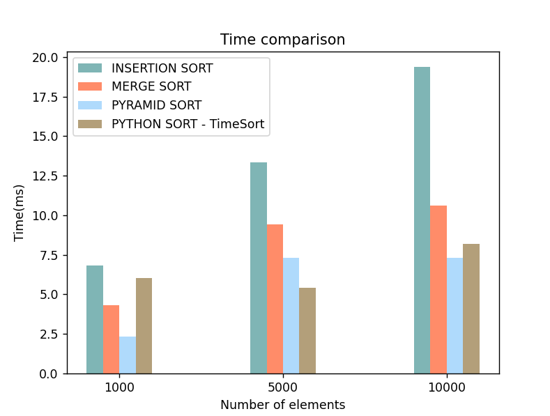
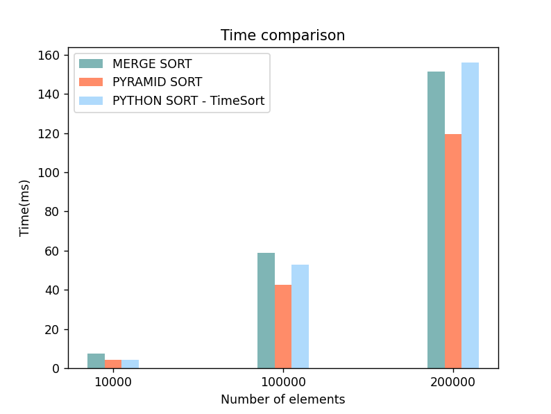

## How to connect the module


>To use the module you need to read the [instructions](https://docs.google.com/document/d/19MxN56CTe5EYoF1h4ljvrmEvjdafgiBWdPQojFqUwz8/edit?usp=sharing)


To use the module, you need to go to the cmd directory where the files are located and enter the following commands:


```
cd [directory]
python setup.py build
python setup.py install
```

## Functions

The user has the ability to use the following functions

```
insertion
merge
pyramid
```

* _insertion_ is an insertion sort. Its essence lies in the fact that, at each step of the algorithm, we take one of the array elements, find a position to insert and insert.
  
* _merge_ is a merge sort. Here the array is divided into two approximately equal parts and each of them is sorted separately. The two sorted subarrays are then merged into one.
  
* _pyramid_ is a heapsort. This is a way of representing elements, in which no more than two branches can depart from each node. And the value in the parent node must be greater than the values in its two child nodes.
  
Each of them has a different execution time depending on the size of the array.
  
time complexity:
* O(n * n)
* O(n log n)
* O(n log n)

## Peculiarities

All code of the module was written in C. In the course of work, we got acquainted with the API Reference Manual, namely _List Objects_, _Sequence Protocol_, _Floating Point Objects_. Learned to define python - class

## Examples

You can find examples in the _main.py_ file

## Time win

We compared the running time of our functions with the built-in function in python. Python uses different methods depending on the size of the array. We decided to remove insertion sort starting from the dimension equal to 10000. It turned out that heap sort was able to win over python in time.



